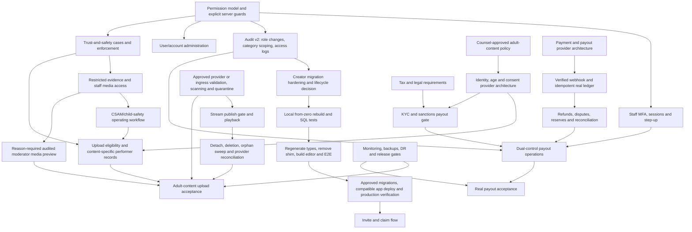

# CABANA Admin Roadmap

> Based on the 2026-07-14 audit of `admin/creator-pages` at `7e72825` against the 918-item CABANA Admin Master Checklist. This is sequencing guidance, not authorization to implement, apply SQL, select vendors, or deploy.
>
> **Update 2026-07-15:** Phase 1A (the hardened base creator-page/editor slice) is SHIPPED — PR #25 squash-merged to `main` (`15cb8ad`), migrations `20260537`–`20260540` applied to cloud (now `20260540`) and verified. Creator lifecycle/ownership hardening (checkpoints 7–9, P0 blocker 8) is complete: `20260540` adds one-page-per-owner uniqueness and blocks owner `page_status`/`user_id` writes; `20260539` restricts finance/ownership audit visibility to admins. **Phase 1B (invite/claim, checkpoint 10) and staff MFA/session hardening remain unshipped.** Roadmap items below that predate this merge are marked inline where load-bearing.

## Roadmap principles

1. Build the control plane before adding more privileged tools: role scopes, explicit server checks, audit isolation, MFA and session controls.
2. Finish one safe vertical slice at a time. Do not develop payments, adult-content operations, support, legal, analytics and system operations simultaneously.
3. Keep mock money and provider delivery clearly labeled until verified providers become the source of truth.
4. Treat unapplied migrations as branch artifacts, not production functionality.
5. Require UI, authorization, SQL/RLS, audit, safe failures, pagination, tests, rollout and production verification for acceptance.

## Top 10 immediate P0 blockers

1. **Staff access security:** mandatory MFA, secure recovery, session inventory/revocation, step-up for payouts/roles/bans/exports, login/action throttling and suspicious-login response.
2. **Least-privilege authorization:** replace the monolithic admin scope with capability roles; add shared `assertAdmin`/`assertStaff`/capability guards and strict denial on every privileged action.
3. **Role and audit governance:** audit every role change, prevent accidental last-admin removal, require reasons/approval for sensitive changes, and stop moderators receiving finance/ownership audit payloads.
4. **Upload admission and object safety:** verification/age policy gate, approved provider/ingress MIME, size and signature validation, malware/content scanning, abuse throttling and quarantine.
5. **Trust-and-safety enforcement:** case/evidence model, priorities/SLAs, warnings/strikes/removals/restrictions/suspensions/bans/payout holds, appeals, severe-action review and safe media access.
6. **Adult/child-safety readiness:** counsel-approved policy, creator and performer identity/age, content-specific consent, restricted records, CSAM escalation/preservation/CyberTipline procedure and trained authorized staff. Adult uploads remain disabled.
7. **Stream completion:** server-side publish-readiness enforcement, feed/profile/detail playback, attached-media detach/delete, executable orphan cleanup/provider reconciliation and narrowly audited moderator access.
8. **Creator-page release safety, if included in launch scope:** fix the owner/admin lifecycle boundary and transfer uniqueness, restrict sensitive audit rows, then locally validate the full editor slice before an approved `20260537000000_creator_page_visibility.sql` / `20260538000000_admin_creator_page_management.sql` production sequence. Otherwise explicitly exclude the branch and routes from launch. **(SHIPPED July 15 2026, PR #25 → `main` `15cb8ad`, cloud `20260540`: lifecycle boundary + transfer uniqueness fixed in `20260540`, sensitive audit rows restricted in `20260539`, editor slice live; invite/claim still pending.)**
9. **Real-money safety:** payment/payout providers, tokenized checkout, verified webhooks/idempotency, true accounting/reconciliation, KYC/sanctions/tax, refunds/disputes/reserves, dual approval and provider-confirmed payout settlement. Real money remains disabled.
10. **Operational release safety:** monitoring/alerting, backups/PITR/restore drill, incident/DR runbooks, E2E/accessibility/security/load testing, production approval and rollback verification.

## Dependency graph

## Recommended implementation phases

### Phase 0 — Privileged control plane

**Goal:** make existing admin surfaces safe to extend.

- Define a documented permission matrix for super admin, admin, moderator, finance, payout reviewer, support, compliance and auditor.
- Prefer capability checks over assuming route names imply authority. Add shared server assertions to finance, payout queue, reports, audit and outbox reads/mutations.
- Add role-change and sensitive-read audit events; partition audit visibility by target/action class.
- Require immutable reasons for role, enforcement and money mutations.
- Add cursor pagination, URL-backed filters, safe error mapping and field minimization to current live tools.
- Configure and test staff MFA/session controls; do not infer cloud Auth settings from local code.

**Migration dependency:** a reviewed role/capability and audit-policy migration; avoid expanding the enum until the permission model is approved. The handoff reserves a possible `20260539` audit-visibility migration, but no such file currently exists.

**Tests:** authorized/unauthorized role matrix in SQL; action-level denial; role-change audit; sensitive audit isolation; session/MFA browser tests; pagination completeness.

**Acceptance:** a moderator cannot receive finance/ownership payloads, a non-admin gets a stable 403-equivalent from admin actions, every role change is attributable and immutable, and staff cannot reach admin without required MFA.

### Phase 1 — Close the current creator-page branch safely — 1A SHIPPED (PR #25 → `main` `15cb8ad`, cloud `20260540`); 1B (invite/claim) remaining

**Goal:** finish the already-started slice without widening scope.

Treat this as two releases: **1A** is the hardened base creator-page/editor slice; **1B** is invitation/claim. Release 1B may follow 1A, but if claim is part of the launch scope, launch acceptance waits for both. **1A shipped July 15 2026; 1B not started.**

- First decide which state is creator-controlled editorial lifecycle and which state, if any, is admin-controlled moderation/enforcement. Amend the unapplied creator migrations so raw owner PostgREST writes cannot change an admin-controlled state; add concurrency-safe one-page-per-owner enforcement and intentional nullable-field clearing.
- Review URL validation and validate existing rows before converting a `NOT VALID` constraint.
- Minimize creator ownership audit payloads inside the hardened creator RPC migration. Apply the generic audit/RBAC isolation owned by Phase 0 before the creator RPCs/UI are enabled, so moderators never receive an ownership-audit window.
- Build `/admin/creators/new` and `/admin/creators/$creatorId` only after the backend contract is stable. Reuse the public renderer for preview, and make both public rendering and preview consume `font_family`, `background_style`, link `kind`, ordering and visibility.
- Add hashed, single-use, expiring/revocable invitation and claim flow in a later migration; do not overload the audit follow-up's migration number.

**Migration order:** check every shared preview/staging migration ledger first. Amend `20260537000000_creator_page_visibility.sql` and `20260538000000_admin_creator_page_management.sql` only if neither was applied to a shared environment; otherwise use forward migrations. Then run a local from-zero rebuild and SQL tests, regenerate and commit `types.ts`, remove the cast shim, and build/test the editor and public flow. In production, apply the hardened creator migrations plus the distinct audit/RBAC restriction owned by Phase 0 before enabling creator RPC/UI access; then deploy the compatible app and verify production. The proposed audit-visibility version is reserved in the handoff but does not exist; invitation/claim receives a later distinct version.

**Tests:** Release 1A covers concurrent transfer, direct-owner enforcement-state denial, nullable clearing, legacy URL preflight, all RPC roles, audit payload minimization, rendered appearance/link fields, public draft/archived 404 and editor E2E. Release 1B covers claim replay, expiry, revocation and ownership races.

**Acceptance:** production schema is verified; draft/archived pages are unavailable to anon; creator editorial state is distinct from any admin-controlled enforcement state; raw owner writes cannot change the admin-controlled state; one owner cannot acquire two pages; all mutations are role-correct and audited; and no generated-type shim remains.

### Phase 2 — User, case and enforcement foundation

**Goal:** create the operational center that other admin work depends on.

- User search/detail/timeline, account states, sessions, internal notes and reasoned suspend/ban/restore controls.
- Reports become cases with validated subjects, evidence attachments, priority/SLA, assignment, related/duplicate links and investigator notes.
- Add atomic enforcement actions: warning, strike, removal/quarantine, feature/messaging/posting/purchase restrictions, suspension/ban and payout hold.
- Add appeals and four-eyes review for severe actions.
- Add narrowly scoped, reason-required, fully audited access to reported private content/messages.

**Migration dependency:** account status/action, case/evidence, appeal and enforcement records; restricted RLS views; storage evidence bucket with retention controls.

**Tests:** every staff role, raw PostgREST bypass attempts, evidence access, action rollback/failure, appeal linkage, audit immutability, browser E2E and accessibility.

**Acceptance:** a report can be investigated and resolved without off-platform spreadsheets or unsafe service-role workarounds, and every sensitive read/write is justified and audited.

### Phase 3 — Stream/media completion and upload safety

**Goal:** make the existing provider backend usable and cleanable before enabling non-adult/sandbox video upload UI. Adult-content production upload remains disabled until Phase 4 acceptance.

- Enforce media readiness in `publishPost`/SQL, not only in the composer.
- Add Stream-aware media resolution and signed playback to feed, public profile and post detail.
- Make the authoritative publish operation validate every attached media row and fail closed under attach/publish races; a UI preflight is not sufficient.
- Cover every deletion entry point: creator removal, generic `deletePostMedia`, whole-post deletion, failed-ticket compensation, attached detach, retryable provider tombstones and provider-confirmed remote deletion. Add scheduled orphan cleanup and provider-inventory reconciliation for assets created before a ledger insert.
- Enforce provider/server metadata limits and choose an approved callback scanner, quarantined-ingress architecture or equivalent. Direct browser-to-Cloudflare tus means CABANA's server does not receive bytes and cannot itself inspect signatures or malware.
- Add admin media inventory, lifecycle/error history and evidence holds. Moderator preview must be a dedicated reason-required, audited path—not a blanket staff branch in `can_view_post` or broad staff table access.
- Treat the upload UI in unmerged `origin/stream/5a3-composer-ui` commit `308476b` / draft PR #24 as branch-only. Rebase it onto the authoritative publish, playback and cleanup contracts before merge or enablement.

**Migration dependency:** lifecycle/event history, detach state, deletion jobs/tombstones, retry metadata, evidence holds and narrowly scoped admin access.

**Provider dependency:** existing Cloudflare Stream; callback scanning/quarantine architecture and malware/content provider decisions may block production upload acceptance.

**Tests:** crafted direct action/RPC bypass, attach/publish races, real provider sandbox upload/webhook/playback/delete, unauthorized playback denial, entitlement revocation and token TTL/cache isolation, same-session browser pause/resume/cancel, every deletion entry point, pre-ledger provider orphan reconciliation, sweeper and moderator-preview authorization.

**Acceptance:** processing/error media cannot publish under concurrency; every supported page plays ready video; unauthorized viewers receive no token; entitlement revocation prevents new tokens while already issued bearer tokens expire within an approved maximum TTL. Every deletion entry point either confirms provider deletion or persists a retryable tombstone, and provider inventory reconciliation detects pre-ledger assets. Moderator access is narrow and audited. The target environment must prove a correctly signed provider callback, lifecycle transition, playback and provider-confirmed deletion—the existing unsigned `401` smoke is insufficient. Adult-content production upload stays off.

### Phase 4 — Adult-content, child-safety and verification gate

**Goal:** establish the non-negotiable gate before any adult-content upload is accepted.

- Counsel approves product scope, prohibited-content policy, performer/recordkeeping duties, retention, legal inspection, NCII/deepfake and child-safety procedures.
- Select identity/age/liveness and, if required, consent/document-vault providers.
- Implement creator verification, every-performer identity/age, content-specific consent, co-performer approval, revocation/dispute and blocked-publication rules.
- Implement restricted CSAM escalation, evidence preservation, CyberTipline tracking, custody/access logs, legal holds and staff exposure/wellness controls.

**Dependencies:** Phase 0, Phase 2 and Phase 3; counsel; identity/age provider; specialist child-safety/detection decisions; trained staff and operational accounts.

**Tests:** verification webhook replay/signature, expired/revoked identities, missing performer/consent publish denial, evidence access roles, preservation clocks, incident drills and external procedure review.

**Acceptance:** the “before accepting adult-content uploads” gate later in this document is signed off by engineering, security, trust and safety, operations and counsel.

### Phase 5 — Support, copyright, legal and privacy operations

**Goal:** handle user and regulatory requests without direct database intervention.

- Ticket/CRM queue with account/payment/verification/moderation context and audited escalation.
- DMCA/copyright intake, notices, counter-notices, restoration and repeat-infringer tracking.
- Legal-request validation, preservation/hold, minimization, approval, secure delivery and custody.
- Privacy access/correction/deletion/objection workflow, identity proof, deadlines, retention exceptions and cross-system/vendor deletion.

**Dependencies:** approved policies and retention schedule; email/support vendor decisions; Phase 0 audit roles; Phase 2 account/case model.

**Acceptance:** each request type has a role-scoped queue, deadline, evidence, approvals, immutable history and tested completion across database, storage, caches and vendors.

### Phase 6 — Real payments, payouts and financial compliance

**Goal:** replace simulations only after the business and provider contracts are stable.

- Select tokenized payment and payout providers; document PCI scope and responsibilities.
- Add verified, idempotent webhook event records and provider-derived transaction/accounting entries.
- Introduce true journal/account/entry double-entry accounting and reconciliation; migrate no mock rows into real balances without an explicit plan.
- Add refunds, disputes, chargebacks, negative balances, reserves, provider outages and evidence deadlines.
- Gate payouts on identity/KYC, sanctions, country, tax profile and verified payout method.
- Require provider confirmation for paid status, step-up, two-person approval and reconciliation before release.

**Dependencies:** payment/payout, KYC/identity, sanctions and tax provider decisions; counsel/accounting review; Phases 0, 2 and 5; operational monitoring.

**Tests:** signed/replayed/out-of-order webhooks, idempotency, accounting invariants, provider reconciliation, refund/chargeback reversals, KYC/sanctions holds, dual approval, failure/retry and end-to-end sandbox money movement.

**Acceptance:** the “before processing real payouts” gate later in this document is signed off and a production reconciliation closes to zero unexplained variance.

### Phase 7 — Scale and advanced operations

**Goal:** add P1/P2 breadth only after P0 operations work.

- Notification providers/templates/broadcasts, discovery controls, platform configuration and kill switches.
- Platform-wide analytics with full-history pagination, freshness, exports and scheduled reports.
- Health/queue/vendor/quota/cost dashboards, SIEM/action alerts, backup/restore automation and DR exercises.
- Fraud rules/graphs, advanced recommendations, staff QA and productivity safeguards.

## Top 25 next implementation checkpoints

1. Approve the staff permission matrix and capability naming.
2. Add shared explicit server authorization and stable denial semantics to all existing admin actions.
3. Scope audit visibility by action/target and audit role changes, outbox processing, sensitive reads and exports.
4. Configure/test mandatory staff MFA, recovery, session inventory/revocation and step-up.
5. Add admin/login/report/upload/action rate limits and abuse telemetry.
6. Add approved provider/ingress upload MIME/size/signature validation and a quarantine/scan contract compatible with direct tus uploads.
7. Check shared migration ledgers, then harden the unapplied creator lifecycle/ownership/concurrency invariants in `20260537000000_creator_page_visibility.sql` and `20260538000000_admin_creator_page_management.sql` only if rewrite-safe. **— DONE (hardening shipped in `20260539`/`20260540`, PR #25 → `main` `15cb8ad`).**
8. Run the full local rebuild and SQL suites, regenerate/commit types and remove the shim before production. **— DONE (`types.ts` regenerated, cast shim removed; PR #25 → `main` `15cb8ad`).**
9. Build the creator new/detail editor with real public-render previews and browser E2E; if this slice is in scope, only then run approved production migrations, compatible application deploy and production verification. **— DONE (editor live; migrations applied to cloud `20260540`; PR #25 → `main` `15cb8ad`).**
10. Build hashed invitation/claim with expiry, revocation, replay defense and audit. **— NOT STARTED (invite/claim remains the open Phase 1B slice).**
11. Enforce Stream readiness in the authoritative publish path.
12. Add Stream playback to feed/profile/detail with entitlement and expiry tests.
13. Add detach/delete, orphan sweeper and Cloudflare inventory reconciliation.
14. Build user search/detail/timeline and audited session/account-state controls.
15. Evolve reports into priority/SLA cases with evidence, linking and validated subjects.
16. Add enforcement actions, payout holds, appeals and four-eyes review.
17. Add restricted, reason-required, audited private content/message/media review.
18. Obtain counsel-approved adult-content, consent, child-safety, retention, DMCA, privacy and legal-request requirements.
19. Select and integrate creator/performer identity, age, liveness and consent-record providers.
20. Implement the CSAM emergency queue, evidence vault/preservation, CyberTipline tracking and staff procedures.
21. Build support/CRM plus copyright, legal and privacy request queues on the shared case/audit foundation.
22. Approve payment/payout/KYC/sanctions/tax provider architecture and PCI scope.
23. Build verified/idempotent provider webhooks, true accounting and reconciliation before real checkout.
24. Build provider-confirmed dual-control payouts, refunds/disputes/reserves and financial compliance gates.
25. Add monitoring/alerts, backups/PITR restore exercise and E2E/accessibility/security/load production gates.

Checkpoints 1–10, 11–13, 14–17 and 25 can proceed in separate dependency-ordered workstreams only when shared schemas do not overlap. Checkpoints 18–24 remain gated by decisions and prior foundations; do not start all of them together.

## Dependency and decision register

### Work that can be completed without selecting new vendors

- Permission matrix, explicit guards, safe errors, audit scoping and role-change audit.
- Pagination/URL filters, masking, reason requirements and current admin UX cleanup.
- Creator migration hardening, editor, public preview and invitation token mechanics.
- User/account state, case/evidence/enforcement/appeal schema and UI.
- Stream server publish gate, playback consumers, detach/delete and local orphan scheduling using the existing provider.
- Platform settings model/kill switches, test harnesses, runbooks and release gates.

### Work requiring payment, payout, KYC, identity or other vendors

- Tokenized payment collection, payment intents, 3DS/SCA, chargebacks and reconciliation.
- Bank/payout method verification and provider-confirmed disbursement.
- Creator/performer government ID, DOB, liveness, face match and document expiry.
- Sanctions/PEP/adverse-media screening and rescreening.
- Tax ID/form collection, calculation/filing and secure delivery.
- Email/push delivery, bounce/complaint handling and broadcast deliverability.
- Malware scanning and any prohibited-material hash/detection integration.

### Work requiring legal or specialist review

- Adult-content scope, performer consent/recordkeeping, 18+ assurance and retention/inspection.
- CSAM/CyberTipline duties, preservation, evidence access and law-enforcement handoff.
- NCII/deepfake/trafficking and prohibited-content policies.
- DMCA/copyright, legal requests, privacy rights, deletion/retention exceptions and transparency reporting.
- PCI scope, sanctions program, country restrictions, tax obligations, reserves/refunds and payout terms.
- Staff content-exposure, wellness, training and evidence-access policies.

### Work requiring production migrations

- Creator visibility and management: review shared migration ledgers; locally validate `20260537000000_creator_page_visibility.sql`, then `20260538000000_admin_creator_page_management.sql`, plus a separately created audit-visibility migration; regenerate types before production; then apply migrations and the compatible application in an approved sequence. **(SHIPPED July 15 2026: `20260537`–`20260540` applied to cloud `20260540`, types regenerated, deployed via PR #25 → `main` `15cb8ad`.)**
- Role/capability and role-change audit model.
- Account states/sessions/admin notes/actions.
- Cases, evidence, appeals, strikes/enforcement and holds.
- Verification/performer/consent and restricted evidence records.
- Provider webhook/idempotency, accounting, refund/dispute/chargeback, KYC/sanctions/tax records.
- Platform configuration/versioning and operational job/incident records.

Every migration requires from-zero rebuild, RLS/GRANT review, authorized/unauthorized SQL tests, rollback/forward-recovery notes and production post-verification. The cloud migration ledger mismatch documented in `CABANA_TECH_DEBT.md` means `supabase db push` must remain prohibited until separately repaired.

### Work requiring new staff roles

- Super admin/break-glass: emergency role management and high-risk configuration only.
- Finance: financial reads/reconciliation without private content.
- Payout reviewer: payout decisions with dual-control separation.
- Support: account/ticket context without balance or private-content mutation.
- Compliance: identity/sanctions/tax/legal-hold records.
- Auditor: minimized read-only audit/report access.
- Senior moderator: severe enforcement/appeal second review.
- Later P1 roles: legal request, fraud investigator, analytics-only, marketing and engineering operations.

## Work to defer until real payment processing exists

Do not operationalize scheduled payout batches, provider failover, currency conversion, chargeback evidence submission, refund automation, reserve release, tax filing/returns, payout forecasts or payment-risk ML against simulated transactions. Their schemas may be designed only after provider event and accounting contracts are approved. Keep `mark_paid` explicitly simulated; replace it with provider-confirmed settlement rather than adapting the mock transition into production.

## What may remain mock for a private demo

- Admin overview/growth/verification/subscription/featured cards, if every panel remains unmistakably labeled sample and all dead controls remain disabled.
- Creator subscriptions, tips, paid unlocks, ledger, balances, earnings analytics and payout review, with “no real money” disclosures at the action point.
- Notification email/push outcomes and outbox processing, if no delivery claim is made.
- Creator-page management in local/preview only before migration approval; do not present branch-only publish state as production.

Even in a private demo, authentication/RLS, secret handling, locked-content authorization, upload limits, audit integrity and data cleanup cannot be treated as fake.

## Gate before accepting adult-content uploads

All of the following are required; a generic “18+” checkbox is insufficient:

- Counsel-approved platform scope, prohibited-content, performer recordkeeping, consent, retention, inspection, privacy and law-enforcement procedures.
- Mandatory staff MFA/least privilege and restricted identity/evidence vault access with view audit.
- Creator identity, DOB/age and liveness verification before any upload ticket.
- Every depicted performer identity/age verification, content association, consent version/date and co-performer approval; solo/group declarations.
- Publication blocked when any performer/consent/verification record is absent, expired, revoked or disputed.
- Approved provider/ingress file type/size/signature validation, malware scan, quarantine and abuse throttling.
- Report/case/evidence/enforcement/appeal workflows, including NCII/deepfake/trafficking indicators and payout holds.
- CSAM emergency restriction, redistribution prevention, preservation, access logging, custody, CyberTipline tracking, trained reporters and 24/7 escalation.
- Stream playback/deletion/orphan cleanup and audited moderator review.
- Tested incident, breach, backup/restore and content-removal procedures; trained staff and production acceptance exercise.

## Gate before processing real payouts

- Approved payment and payout providers; tokenized card architecture and documented PCI scope.
- Verified webhook signatures, replay/idempotency/out-of-order handling and provider outage mode.
- True double-entry journal/accounts/entries and provider/bank reconciliation.
- Creator identity/KYC, sanctions/country, tax profile and payout-method ownership verification.
- Refund, dispute, chargeback, negative-balance, rolling/chargeback reserve and reversal rules.
- Fraud/risk review, rapid bank-change cooling period and payout anomaly holds.
- Dedicated finance/payout roles, mandatory MFA/step-up, two-person approval and immutable required reasons.
- Paid status set only from provider confirmation; failed/returned/reversed transfers handled and reconciled.
- Payout statements, support/escalation, monitoring/alerts, backups/DR, sandbox E2E and a production reconciliation with no unexplained variance.

## Test requirements by phase

| Phase | Minimum automated evidence |
|---|---|
| 0 | Role matrix SQL, strict action denials, audit isolation/immutability, MFA/session browser E2E, pagination completeness |
| 1 | Creator RPC/RLS/concurrency, public visibility, invitation replay, editor/public-page browser E2E |
| 2 | Case/evidence/enforcement authorization, raw API bypass, audit, appeal and accessibility E2E |
| 3 | Provider sandbox upload/webhook/playback/delete, entitlement denial, cleanup, admin media E2E and load limits |
| 4 | Identity/consent webhook/idempotency, publish denial, restricted evidence and incident tabletop evidence |
| 5 | Deadline/approval/retention/deletion workflows, secure export and role-based browser E2E |
| 6 | Provider sandbox money, webhook replay/order, accounting invariants, reconciliation, refunds/disputes and dual approval |
| 7 | Analytics completeness, queue/alert failure injection, restore/DR, accessibility, load and security tests |

The configured Vitest 95% thresholds must be run in CI (`test:coverage`) before being treated as an enforced gate; current CI runs `bun run test`.

## Production acceptance criteria

For every admin capability:

- Route and action both enforce the approved capability; raw PostgREST/RPC bypass tests fail closed.
- Sensitive fields are minimized/masked and reads/mutations are audited with actor, role, reason, request context and target.
- Queries use cursor/page pagination with a truthful completeness indicator; filters are shareable.
- Loading, empty, safe error, confirmation and retry behavior are tested; destructive/money/enforcement reasons are required.
- Migration rebuild, unit, SQL, integration, browser E2E and accessibility gates pass; relevant provider sandbox tests pass.
- Preview is reviewed, production deploy/migration order and rollback or tested forward-recovery are approved, post-deploy smoke verifies the actual capability, and remote/test artifacts are clean.
- Handoff, route/API/database docs and roadmap are updated without contradictory production claims.

## Suggested PR boundaries

1. **Authorization contract:** shared guards and strict existing-action denial; no UI redesign.
2. **Audit/RBAC migration:** own the distinct audit-category isolation, role-change audit and permission schema/tests; deploy it before creator RPC/UI enablement.
3. **Staff Auth controls:** MFA/session/step-up UI and E2E; provider configuration tracked separately.
4. **Creator migration hardening:** after checking every shared migration ledger, amend only unapplied `20260537000000_creator_page_visibility.sql` / `20260538000000_admin_creator_page_management.sql`; minimize creator-specific audit payloads and add tests; consume, but do not own, boundary 2's generic audit migration; no editor UI.
5. **Creator editor:** new/detail/editor preview only after schema/types; invitation/claim in its own PR and migration.
6. **Stream authoritative gate/playback:** publish check and feed/profile/detail player; no admin tooling.
7. **Stream cleanup:** detach/delete/tombstones/sweeper/provider reconciliation; no staff access expansion.
8. **Admin media oversight:** inventory, evidence holds and reason-required moderator preview, stacked on the Phase 2 evidence/audit foundation.
9. **User/case foundation:** account states plus cases/evidence; enforcement/appeals in a follow-up PR.
10. **Policy-dependent operations:** adult/CSAM, support/DMCA/legal/privacy split into narrowly reviewed vertical PRs after requirements sign-off.
11. **Real-money program:** provider event ingestion/accounting first, checkout second, refunds/disputes third, payout/KYC fourth; never one combined PR.
12. **Operations/release:** monitoring/alerts, backups/restore and CI E2E/a11y/security/load gates as independent, observable changes.

The recommended first implementation checkpoint is suggested PR boundary 2: audit/RBAC isolation and role-change audit, as a SQL-only, behaviorally tested change. Stack suggested boundary 4 on it to harden the creator lifecycle/ownership migrations after verifying they are unapplied in every shared environment. Do not apply either creator migration until both scopes are reviewed; this wording refers to roadmap boundaries, not Stream PR #24 or creator PR #25.
